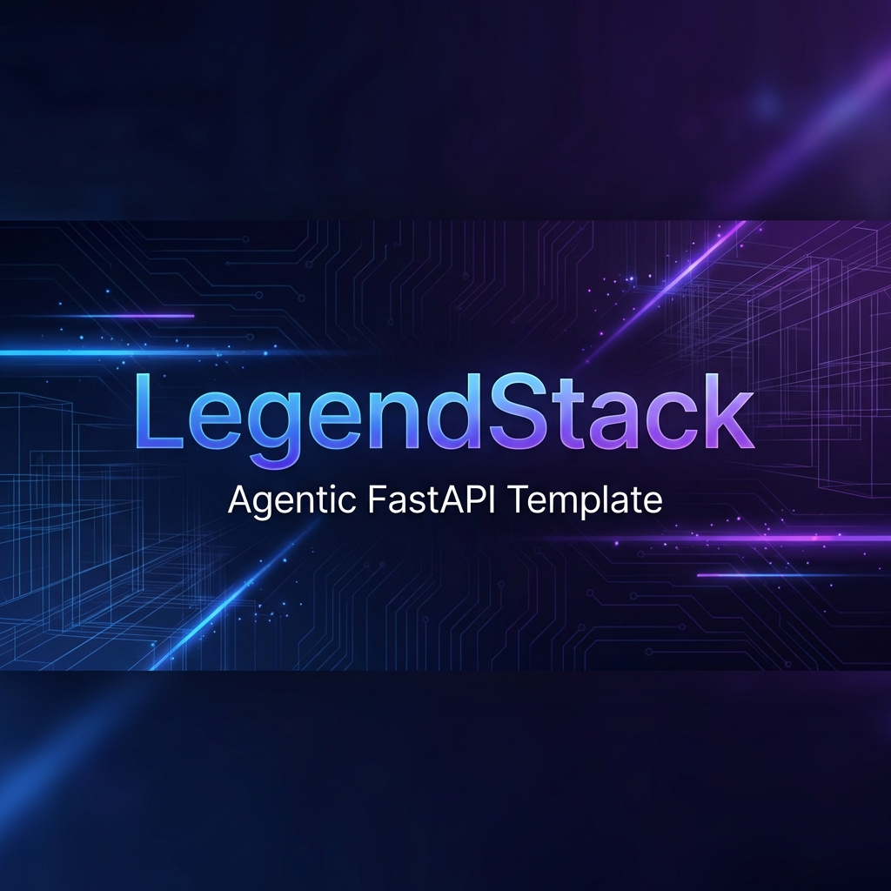

<h1 align="center">🚀 LegendStack Agentic FastAPI Template</h1>
<p align="center" markdown=1>
  <i><b>Ship production-ready AI agents in hours, not months.</b></i>
</p>

<p align="center">
  <a href="https://github.com/LegendStack/agentic-fastapi-template">
    
  </a>
</p>

<p align="center">
  <a href="https://github.com/LegendStack/agentic-fastapi-template/actions">
    
  </a>
  <a href="https://github.com/LegendStack/agentic-fastapi-template">
    
  </a>
  <a href="LICENSE">
    
  </a>
  <a href="https://LegendStack.github.io/agentic-fastapi-template/">
    
  </a>
  <a href="https://deepwiki.com/LegendStack/Agentic-FastAPI-Template">
    
  </a>
  <a href="https://discord.gg/legendstack">
    
  </a>
</p>

<p align="center">
📚 <a href="https://LegendStack.github.io/agentic-fastapi-template/">Documentation</a> · 
🎓 <a href="docs/tutorials/index.md">Tutorials</a> · 
🔧 <a href="docs/guides/index.md">Guides</a> · 
💬 <a href="https://discord.gg/legendstack">Discord</a>
</p>

---

## ⚡ Time to First Agent

```bash
git clone https://github.com/LegendStack/agentic-fastapi-template
cd agentic-fastapi-template && docker compose up
```

**That's it.** Your agent is running at `http://localhost:8000/docs` with:
- 🤖 Demo Agent showcasing all features (no API keys needed)
- 📚 RAG pipeline with vector search
- 🛡️ Safety guardrails (PII masking, moderation)
- 💬 Real-time streaming (SSE/WebSocket)

> [!TIP]
> **New to LegendStack?** Start with the [Interactive Tutorial](docs/tutorials/index.md) — it walks you through every feature in 90 minutes.

---

## 🎯 Why LegendStack?

| Building AI Agents From Scratch | With LegendStack |
|--------------------------------|------------------|
| Set up FastAPI, auth, database, caching... | ✅ Batteries included |
| Build RAG pipeline from scratch | ✅ Production-ready RAG with reranking |
| Figure out LangGraph patterns | ✅ 11 modular node examples |
| Add safety guardrails | ✅ PII masking, moderation built-in |
| Implement caching, rate limiting | ✅ Semantic cache, tiered limits |
| Debug memory, threading issues | ✅ Entity-aware cross-thread memory |
| Build monitoring, cost tracking | ✅ OpenTelemetry + cost tracking |
| **Weeks/Months** | **Hours** |

---

## 🏗️ What's Included

<table>
<tr>
<td width="50%">

### 🔧 Core Platform
- ⚡ FastAPI + SQLAlchemy 2.0 (fully async)
- 🔐 JWT Auth + Microsoft Entra ID (Azure AD)
- 👮 Tiered Rate Limiting (Free/Standard/Premium)
- 🧊 Redis Caching + Background Jobs (ARQ)
- 🐳 Docker Compose (dev/staging/production)

</td>
<td width="50%">

### 🤖 Agentic AI Framework
- 🧠 LangGraph Orchestration with state management
- 📚 RAG with pgvector or Azure AI Search
- 🔗 Graph-RAG with Neo4j knowledge graphs
- 🛡️ Safety Guardrails (PII, moderation)
- ⚡ Semantic Caching (reduce LLM costs 70%+)

</td>
</tr>
<tr>
<td width="50%">

### 🔌 Enterprise Integrations
- 📝 Jira, Confluence, SharePoint, OneDrive
- 🔍 Azure OpenAI, Cohere, Cross-Encoders
- 📊 OpenTelemetry (Datadog, Honeycomb)
- 🔐 Azure Key Vault, Managed Identity
- 🛡️ HashiCorp Vault (AppRole Auth)

</td>
<td width="50%">

### 🎓 Developer Experience
- 🖥️ LegendStack Studio (Streamlit dashboard)
- 🛠️ CLI for scaffolding agents/connectors
- 📓 Jupyter Tutorial (8 chapters)
- 📋 Production Checklist (28 items)

</td>
</tr>
</table>

---

## 📚 Learning Resources

| Resource | Format | Time | Best For |
|----------|--------|------|----------|
| [**Quick Start**](docs/getting-started/index.md) | Docs | 5 min | Get running fast |
| [**Jupyter Tutorial**](notebooks/tutorial.ipynb) | Notebook | 90 min | Hands-on learning |
| [**Streamlit Walkthrough**](studio/tutorial_app.py) | Web App | 30 min | Visual learners |
| [**Integration Guide**](docs/guides/integration.md) | Docs | 15 min | Connect real services |
| [**Customization Cookbook**](docs/guides/cookbook.md) | Docs | — | Add your logic |
| [**Production Checklist**](docs/guides/production-checklist.md) | Checklist | — | Pre-deploy review |

---

## 🚀 Quick Start Examples

<details>
<summary><b>🤖 Chat with the Demo Agent</b></summary>

```python
from app.agents.demo import LegendDemoAgent

agent = LegendDemoAgent()  # Uses mocks (no API keys needed)
result = await agent.chat("What is LegendStack?")

print(result["response"])
print(result["features_used"])  # Shows which features were invoked
```

</details>

<details>
<summary><b>☁️ Connect Azure OpenAI</b></summary>

```python
from app.core.integration_config import configure_integrations, get_azure_openai_client

configure_integrations()  # Auto-configures from .env
client = get_azure_openai_client()
response = await client.chat([{"role": "user", "content": "Hello!"}], deployment="gpt-4o")
```

</details>

<details>
<summary><b>🔍 RAG with Reranking</b></summary>

```python
from app.agents import RerankingService, CrossEncoderReranker

docs = await vector_store.search("How to deploy?", k=20)
reranker = RerankingService(CrossEncoderReranker())
top_docs = await reranker.rerank("How to deploy?", docs, top_k=5)
```

</details>

<details>
<summary><b>🛡️ Resilient LLM Calls</b></summary>

```python
from app.agents import ResilientClient

client = ResilientClient(name="openai")  # Retry + circuit breaker
result = await client.execute(call_llm, prompt)  # Auto-retries on failure
```

</details>

<details>
<summary><b>🛠️ CLI: Generate New Agent</b></summary>

```bash
uv run python src/app/cli/main.py create-agent CustomerSupport
uv run python src/app/cli/main.py create-connector Slack
```

</details>

<details>
<summary><b>🖥️ Launch Studio Dashboard</b></summary>

```bash
streamlit run studio/main.py
```

</details>

---

## ⏱️ Time to Production

| Milestone | Time |
|-----------|------|
| Clone & run with mocks | 5 min |
| Connect real Azure OpenAI | 30 min |
| Customize for your use case | 2-4 hours |
| Production-ready | 1-2 days |

---

## 🏃 Setup Options

**Interactive setup:**
```bash
./setup.py  # Choose: local / staging / production
```

| Environment | Config | Best For |
|-------------|--------|----------|
| `local` | Uvicorn + auto-reload | Development |
| `staging` | Gunicorn + workers | Load testing |
| `production` | NGINX + Gunicorn | Deployment |

Then:
```bash
docker compose up
```

> 📖 Full setup guide: [Getting Started](https://LegendStack.github.io/agentic-fastapi-template/getting-started/)

---

## 🗺️ Project Structure

```
src/app/
├── agents/           # 🤖 Agentic AI framework
│   ├── demo/         #    Demo agent with all features
│   ├── nodes/        #    Reusable LangGraph nodes
│   ├── connectors/   #    Enterprise integrations
│   └── guardrails/   #    Safety & moderation
├── api/v1/           # 🔌 REST endpoints
├── core/             # ⚙️ Config, DB, auth
└── cli/              # 🛠️ Developer tools

docs/
├── getting-started/  # 📚 Quick start
├── tutorials/        # 🎓 Interactive learning
├── guides/           # 🔧 Integration & cookbook
└── user-guide/       # 📖 Detailed reference

notebooks/
└── tutorial.ipynb    # 📓 8-chapter Jupyter tutorial

studio/
└── tutorial_app.py   # 🖥️ Streamlit walkthrough
```

---

## 🧪 Testing

```bash
# Run all tests (161 tests)
uv run pytest tests/ -v

# Run specific test file
uv run pytest tests/test_demo_agent.py -v
```

---

## 🔐 HashiCorp Vault Configuration

To enable Vault integration (AppRole Auth):

```bash
VAULT_ENABLED=true
VAULT_URL=http://localhost:8200
VAULT_ROLE_ID=<your-role-id>
VAULT_SECRET_ID=<your-secret-id>
VAULT_SECRET_PATH=secret/data/my-app
```

---

## 🤝 Contributing

We welcome contributions! See [CONTRIBUTING.md](CONTRIBUTING.md) for guidelines.

- 🐛 [Report bugs](https://github.com/LegendStack/agentic-fastapi-template/issues)
- 💡 [Request features](https://github.com/LegendStack/agentic-fastapi-template/issues)
- 📖 [Improve docs](https://github.com/LegendStack/agentic-fastapi-template/tree/main/docs)

---

## 📜 License

[MIT](LICENSE) — use it for anything.

---

<p align="center">
  <sub>Built with ❤️ by the LegendStack team</sub>
</p>

<p align="center">
  <a href="https://github.com/LegendStack/agentic-fastapi-template">
    
  </a>
</p>
